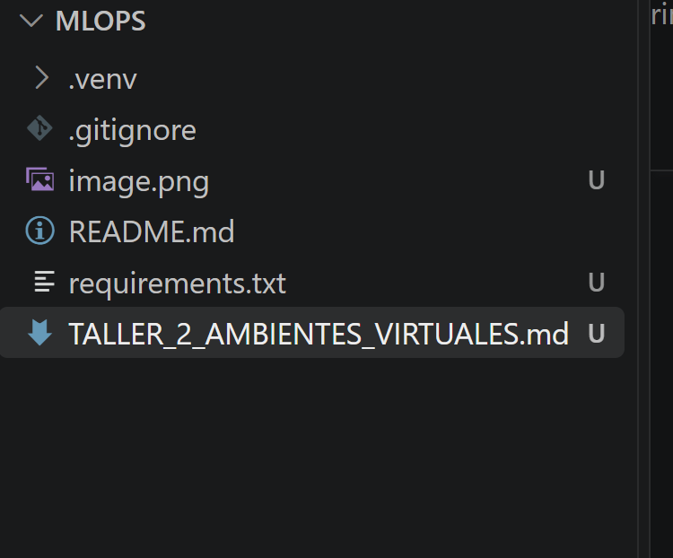
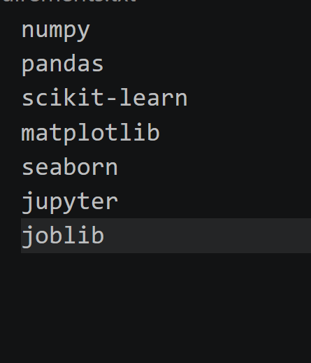
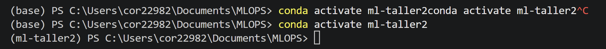

# Machine Learning Engineering

## Taller 2: Ambientes virtuales de Python

**Nombre:** Mathew Cordero  
**Carné:** 22982 
**Fecha:** 29 de Sep  
**Repositorio:** [Repo](https://github.com/donmatthiuz/MLOPS/tree/taller1)

---


## 1. Descripción del ejercicio

En este taller se explora la creación y administración de ambientes virtuales con Python y Conda. También se definen los archivos de dependencias necesarios para reproducir un proyecto de Machine Learning.

## 2. Ambiente virtual de Python

### 2.1 Documentación consultada

- Documentación oficial de Python sobre `venv`: <https://docs.python.org/3/library/venv.html>
- Documentación de VS Code sobre ambientes de Python: <https://code.visualstudio.com/docs/python/environments>

### 2.2 Creación del ambiente

Comandos utilizados en PowerShell:

```powershell
python --version
python -m venv .venv
.\.venv\Scripts\Activate.ps1
python -m pip install --upgrade pip
```

Para comprobar que el ambiente quedó activo:

```powershell
python -c "import sys; print(sys.executable)"
pip --version
```

### 2.3 Evidencia




### 2.4 Archivo de requisitos

Por convención, el archivo de dependencias utilizado con `pip` se llama `requirements.txt`.

Contenido utilizado:

```text
numpy
pandas
scikit-learn
matplotlib
seaborn
jupyter
joblib
```




Instalación y verificación:

```powershell
python -m pip install -r requirements.txt
python -m pip check
```


## 3. Ambiente virtual con Anaconda/Conda

### 3.1 Documentación consultada

- Administración de ambientes Conda: <https://docs.conda.io/projects/conda/en/latest/user-guide/tasks/manage-environments.html>

### 4.2 Creación del ambiente

Comandos utilizados en Anaconda Prompt o en una terminal con Conda disponible:

```powershell
conda --version
conda create --name ml-taller2 python=3.12 -y
conda activate ml-taller2
python --version
conda env list
```

Instalación de paquetes:

```powershell
conda install numpy pandas scikit-learn matplotlib seaborn jupyter joblib -y
```

### 4.3 Archivo de ambiente de Conda

Conda suele definir ambientes reproducibles mediante un archivo llamado `environment.yml`:

```yaml
name: ml-taller2
channels:
  - conda-forge
  - defaults
dependencies:
  - python=3.12
  - numpy
  - pandas
  - scikit-learn
  - matplotlib
  - seaborn
  - jupyter
  - joblib
  - pip
```

El archivo puede generarse desde el ambiente actual:

```powershell
conda env export --from-history > environment.yml
```

También puede usarse para recrear el ambiente:

```powershell
conda env create -f environment.yml
```

### 4.4 Evidencia Conda





## 4. Comparación con otras herramientas

Para las siguientes tablas se toma como herramienta base el flujo tradicional descrito en este taller: `venv` para crear el ambiente virtual, `pip` para instalar paquetes y `requirements.txt` para registrar dependencias.

### 4.1 Comparación de venv/pip con UV

> **Indicación:** esta tabla ya está redactada. El grupo debe revisarla con el artículo de DataCamp y adaptarla si desea incluir hallazgos propios.

| Criterio | venv + pip | UV |
|---|---|---|
| Propósito principal | `venv` crea ambientes aislados y `pip` instala paquetes. | Integra administración de proyectos, ambientes, versiones de Python y dependencias en una herramienta. |
| Velocidad | La resolución e instalación puede ser más lenta en proyectos grandes. | Está implementado en Rust y se enfoca en instalaciones y resolución de dependencias rápidas. |
| Creación del ambiente | Se ejecuta `python -m venv .venv` y luego se activa manualmente. | Puede crearse con `uv venv`; además, `uv run` crea o sincroniza el ambiente cuando es necesario. |
| Instalación de paquetes | Se utiliza `python -m pip install paquete`. | Se puede utilizar `uv add paquete` en un proyecto o `uv pip install paquete` con una interfaz compatible con `pip`. |
| Archivos principales | Normalmente utiliza `requirements.txt`; el bloqueo exacto requiere prácticas o herramientas adicionales. | Utiliza `pyproject.toml` para declarar dependencias y `uv.lock` para registrar versiones resueltas. |
| Reproducibilidad | Depende de fijar versiones correctamente, por ejemplo mediante `pip freeze`. | El archivo `uv.lock` permite reproducir de forma consistente las versiones directas y transitivas. |
| Administración de Python | Usa una instalación de Python que ya debe estar disponible en el sistema. | Puede instalar y seleccionar versiones de Python mediante comandos de UV. |
| Compatibilidad | Es el flujo estándar incluido con Python y tiene amplia compatibilidad. | Admite proyectos modernos y flujos compatibles con `pip` y archivos de requisitos. |
| Curva de aprendizaje | Es sencillo y apropiado para aprender los fundamentos. | Requiere aprender nuevos comandos, aunque concentra varias tareas en una sola herramienta. |
| Uso recomendado | Scripts sencillos, talleres introductorios y proyectos con pocas dependencias. | Proyectos que buscan mayor velocidad, bloqueo reproducible y una herramienta unificada. |

Ejemplo de un flujo básico con UV:

```powershell
uv init
uv add numpy pandas scikit-learn joblib
uv run python --version
```

### 4.2 Comparación de venv/pip con Poetry

> **Indicación:** esta tabla ya está redactada. El grupo debe revisarla con el artículo de DataCamp y adaptarla si desea incluir hallazgos propios.

| Criterio | venv + pip | Poetry |
|---|---|---|
| Propósito principal | Combina una herramienta de ambientes con un instalador de paquetes. | Administra dependencias, ambientes, metadatos, construcción y publicación de proyectos. |
| Creación del ambiente | Se crea y activa manualmente con `python -m venv .venv`. | Crea y administra automáticamente un ambiente por proyecto al instalar dependencias. |
| Instalación de paquetes | Se utiliza `python -m pip install paquete` y se actualiza manualmente `requirements.txt`. | `poetry add paquete` instala la dependencia y actualiza la configuración y el archivo de bloqueo. |
| Archivos principales | Generalmente `requirements.txt`; la metadata del paquete puede estar en `pyproject.toml`. | Utiliza `pyproject.toml` y genera `poetry.lock`. |
| Resolución de dependencias | `pip` instala dependencias compatibles, pero el flujo tradicional no ofrece un archivo de bloqueo propio. | Resuelve el conjunto de dependencias y detecta conflictos antes de completar la instalación. |
| Reproducibilidad | Requiere versiones fijadas o un archivo generado con `pip freeze`. | `poetry.lock` conserva versiones exactas, incluidas las dependencias transitivas. |
| Grupos de dependencias | Normalmente requiere varios archivos, por ejemplo `requirements-dev.txt`. | Permite declarar grupos como desarrollo, pruebas o documentación dentro del proyecto. |
| Construcción y publicación | Requiere herramientas adicionales, como `build` y `twine`. | Incluye comandos como `poetry build` y `poetry publish`. |
| Ejecución en el ambiente | Se activa el ambiente antes de ejecutar el programa. | Permite ejecutar directamente con `poetry run` o entrar al ambiente administrado. |
| Curva de aprendizaje | Tiene pocos conceptos iniciales y comandos conocidos. | Requiere comprender `pyproject.toml`, restricciones de versiones y el flujo propio de Poetry. |
| Uso recomendado | Proyectos pequeños, aprendizaje y compatibilidad con flujos existentes. | Aplicaciones o paquetes compartidos, mantenidos a largo plazo y con dependencias complejas. |

Ejemplo de un flujo básico con Poetry:

```powershell
poetry init
poetry add numpy pandas scikit-learn joblib
poetry run python --version
```

### 4.3 Análisis

Las tres opciones aíslan dependencias, pero su alcance es diferente. `venv` y `pip` ofrecen un flujo básico, transparente y ampliamente compatible. UV busca cubrir el ciclo de administración de dependencias con mayor velocidad y una experiencia unificada. Poetry añade resolución, bloqueo, organización del proyecto y publicación de paquetes mediante un flujo más estructurado. Para un pipeline de Machine Learning compartido por un equipo, UV o Poetry pueden mejorar la reproducibilidad; para aprender cómo funciona el aislamiento de Python o mantener un proyecto sencillo, `venv` y `pip` siguen siendo suficientes.

## 5. Conclusiones


1. Los ambientes virtuales permiten aislar las dependencias de cada proyecto y evitan conflictos entre versiones de paquetes.
2. Un archivo como `requirements.txt` o `environment.yml` facilita que otras personas puedan reproducir el entorno de desarrollo y ejecutar el pipeline.
3. En proyectos de Machine Learning, fijar las versiones ayuda a obtener resultados consistentes durante el entrenamiento, las pruebas y el despliegue.
4. `venv` es una alternativa ligera incluida con Python, mientras que Conda también puede administrar la versión de Python y dependencias que no pertenecen exclusivamente al ecosistema de `pip`.
5. Mantener ambientes separados para desarrollo, pruebas y producción reduce errores y mejora la trazabilidad del proyecto.

## 9. Referencias

- Python Software Foundation. *Creation of virtual environments*. <https://docs.python.org/3/library/venv.html>
- Microsoft. *Python environments in VS Code*. <https://code.visualstudio.com/docs/python/environments>
- Conda. *Managing environments*. <https://docs.conda.io/projects/conda/en/latest/user-guide/tasks/manage-environments.html>
- pip. *Requirements File Format*. <https://pip.pypa.io/en/stable/reference/requirements-file-format/>
- DataCamp. *Python UV: The Ultimate Guide to the Fastest Python Package Manager*. <https://www.datacamp.com/tutorial/python-uv>
- DataCamp. *Python Poetry: Modern and Efficient Python Environment and Dependency Management*. <https://www.datacamp.com/tutorial/python-poetry>

## 10. Lista de verificación antes de entregar

- [ ] Completamos nombres, carnés y fecha.
- [ ] Pegamos el enlace del repositorio.
- [ ] Incluimos `requirements.txt`.
- [ ] Incluimos `environment.yml`.
- [ ] Pegamos la captura del ambiente creado con `venv`.
- [ ] Pegamos la captura del ambiente creado con Conda.
- [ ] Documentamos los requisitos del pipeline de scikit-learn.
- [ ] Revisamos las tablas comparativas con UV y Poetry.
- [ ] Escribimos los nombres de todos los integrantes de Project Groups.
- [ ] Redactamos o adaptamos las conclusiones.
- [ ] Verificamos que las imágenes se visualicen en Markdown.
